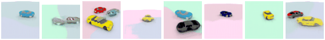
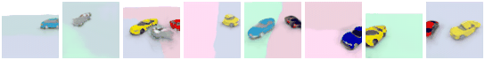
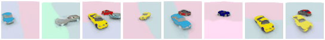
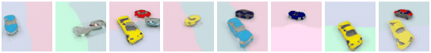

# Towards Unsupervised Learning of Generative Models for 3D Controllable Image Synthesis
This repository contains the code for the paper [Towards Unsupervised Learning of Generative Models for 3D Controllable Image Synthesis](https://avg.is.tuebingen.mpg.de/publications/liao2020cvpr).

To cite this work, please use
```
@inproceedings{Liao2020CVPR,
  title = {Towards Unsupervised Learning of Generative Models for 3D Controllable Image Synthesis},
  author = {Liao, Yiyi and Schwarz, Katja and Mescheder, Lars and Geiger, Andreas},
  booktitle = { Proceedings IEEE Conf. on Computer Vision and Pattern Recognition (CVPR)},
  year = {2020}
}
```
# Installation
Our method requires an accessible CUDA device and is tested for Python 3.7.x .

Create and activate a conda environment with all requirements from the provided `environment.yml` file
```
conda env create -f environment.yml
conda activate controllable_gan
```

Build our customized version of Neural Mesh Renderer by running
```
cd externals/renderer/neural_renderer
python setup.py install
```

# Datasets
Here you can download the datasets used in our paper:
 - [Cars w/o background](https://s3.eu-central-1.amazonaws.com/avg-projects/controllable_gan/data/shapenet_car.zip) (0.5G)
 - [Cars with background](https://s3.eu-central-1.amazonaws.com/avg-projects/controllable_gan/data/shapenet_car_bg.zip) (3.5G)
 - [Indoor](https://s3.eu-central-1.amazonaws.com/avg-projects/controllable_gan/data/indoor_car_bg.zip) (5.1G)

# Usage
First download your data and put it into the `./data` folder.

To train a new model, first create a config script similar to the ones provided in the `./configs` folder.  You can then train you model using
```
python train.py PATH_TO_CONFIG
```

To compute FID scores for your model use
```
python test.py PATH_TO_CONFIG
```

Finally, you can create nice samples with object rotation, translation and camera rotation using
```
python test_transforms.py PATH_TO_CONFIG
```

# Results
- Object rotation\

- Object translation\

- Camera rotation (azimuth)\

- Camera rotation (polar)\


